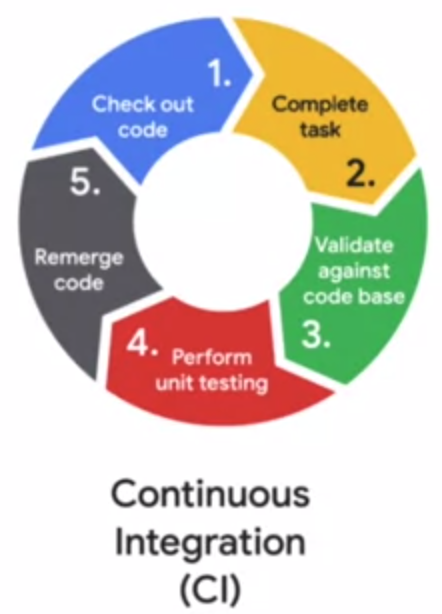
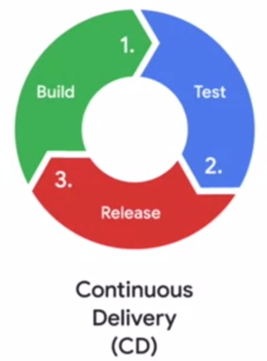

# MLOps

## What is MLOps?

> MLOps is a **lifecycle management discipline** for ML

MLOps borrows several concepts from DevOps:

1. Continuous integration
2. Continuous deployment

## Continuous Integration

Work is carried out on independent branches and merged back into the main branch once complete.
This practice encourages small, frequent changes so that WIP does not go stale & developers are less likely to face tortuous merge conflicts. 

## Continuous Delivery

Completed work is released to production as soon as it has passed quality checks, rather than batching up many changes for release on an arbitrary, possibly distant, release date
This reduces risk by reducing the surface area for debugging if a release has an issue, and minimising the time between developing a bug & discovering it (making it much cheaper to fix).

To these, it adds the practice of **Continuous Training** to manage model drift.

## Differences between DevOps & MLOps

| DevOps | MLOps |
|---|---|
|Test and validate code + components| Test and validate code + components, data schemas, data & models|
| Deploy code and monitor services | Deploy model & monitor, retrain and reserve the model |

## Organisational ML Maturity

1. Models are trained & deployed manually
2. Models are trained in automated pipelines, but deployment is still manual
3. Training, validation & deployment are all automated