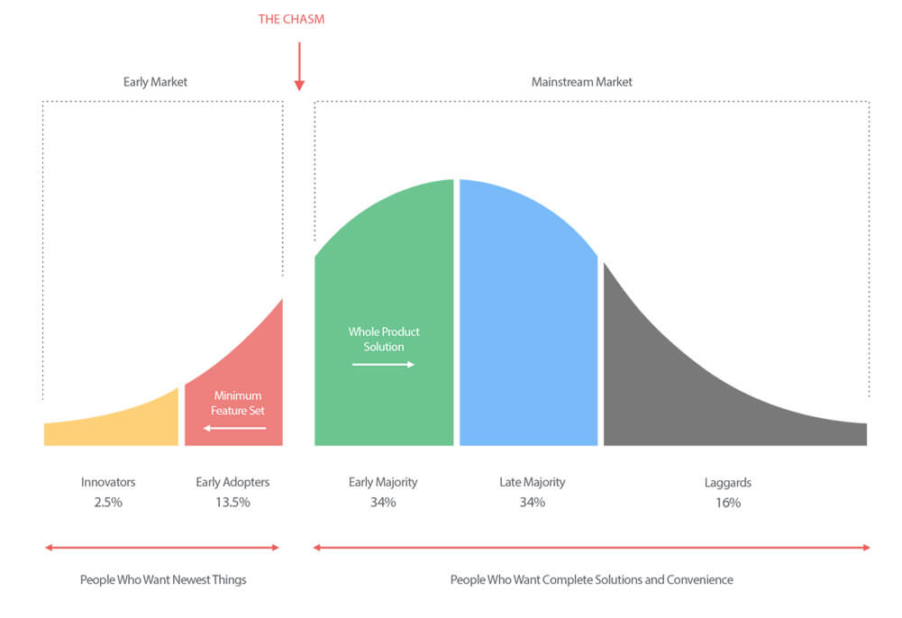

# Book summary: Crossing the Chasm
by Geoffrey Moore

## The Technology Adoption Life Cycle and its Inhabitants

The technology adoption lifecycle model describes how the profile of the consumers for a technology product changes as it matures, and the relative sizes of these different groups.

The model groups consumers into 5 psychological / demographic clusters which must be tackled in sequence:

1. Innovators
1. Early adopters
1. Early majority
1. Late majority
1. Laggards

> Marketing: taking actions to create, grow, maintain, or defend markets.

## The Chasm

The **Chasm** represents the transition from selling to early adopters to the early majority.

### Two very different buying profiles

The ***early adopter*** adopts the product as a **change agent**:

- Want an opportunity to gain an advantage over their competition
- Expect a 'radical discontinuity' with their existing processes in order to achieve this
- Paying for the possibility of gaining an edge: willing to be more involved in product feedback, to accept bugs, glitches, and to work with a less polished product in order to get ahead of the market

The ***early majority***, in contrast, wants to buy a productivity improvement for their existing operations:

- Looking for evolution, not revolution: the product now needs to merge seamlessly with their existing processes to enhance them, rather than causing major disruption
- Paying for a service rather than R&D: the value should already be demonstrable rather than in the pipeline. No time for bugs, poor usability or incomplete features
- Expect the service to integrate  with their existing technology base where appropriate
- Place a very high value on references & support

### The Chasm opens

The Chasm arises as a result of the vitally important role that (positive & relevant) references play in buying decisions:

1. Members of the early majority **will not buy** without having at least several p+r references (and no negative ones!)
1. The early majority do not consider the early adopters to be good references; they seek references from other members of the early majority
1. So in order to sell effectively to the early majority, we need to already have existing customers from the early majority to provide p+r references!

This need for p+r references is key to how we should define a market (segment):

- A set of actual / potential customers
- for a set of products / services
- who have a common set of needs / wants
- who reference each other when making a buying decision

> So a set of potential customers for a product who share the same needs but do not reference each other when making a buying decision are **not** in the same market segment.

## Making your Crossing

In order to cross the chasm, we must focus exclusively on building a dominant position in 1-2 narrowly bounded segments. This focus is necessary in order to:

1. Ensure your organisation's ability to provide & leverage a 'whole product'
1. Generate word-of-mouth momentum
1. Create the perception of being a market leader

Cross the chasm by targeting a very specific niche market where you can dominate from the outset. Concentrate all your resources on a very focused target.
Failure to do so will be like scattering pebbles into an ocean rather than dropping a boulder in a pond - your marketing spend will fail to make waves & generate the word of mouth / appearance of dominance required to convince the early majority pragmatists to buy.

Failing to operate in a tightly-bound market will mean your marketing messages diffuse too quickly and fail to generate word-of-mouth - leaving the sales force to sell to cold prospects, rather than warm ones.
This is a classic symptom of young companies leaving the early market, and it is usually interpreted as a letdown in the sales force or a cooling off in demand when it is actually a simple consequence of trying to expand too rapidly and too broadly into too loosely-bounded a market.

Adjacent markets & the "bowling pin" strategy: target a segment not just because one can "knock it over" but because, in doing so, it will help to knock over the next target segment - propelling us to accelerated growth.

Sequencing markets in this way can also help to ensure that we get the appropritate references in place for each segment that we want to hit next.

### Disciplined Focus

The 'D-day' strategy seeks to galvanise the whole organisation by focusing on a highly specific goal that is:

1. Readily achievable
1. Can be directly leveraged into long-term success

> Most companies fail to cross the chasm because, confronted with the immensity of opportunity represented by a mainstream market, they lose their focus - chasing every opportunity that, but finding themselves unable to deliver a salable proposition to any true pragmatist buyer.
> Trying to cross the chasm without taking a niche market approach is like trying to light a fire without kindling.

Why do so many high-tech leaders fail to follow this advice?

Often, the claim is made that although a niche marketing strategy is generally best, we cannot afford to do so: we are too short on time or resources to risk being so focused.
The truth is much simpler: "we are not willing to adopt any discipline that would ever require us to stop pursuing any sale at any time for any reason.". We are, in other words, not a market-driven company; we are a sales-driven company.

> The consequences of being sales-driven during the chasm period are fatal.

Why? The sole objective for a company during this stage of market development must be to secure a beachhead in a mainstream market; to create a pragmatist customer base that is referenceable (positive & relevant).
The customer **must** get the "whole product": if any part of the selling promise is left unfulfilled then that customer is not available for referencing.

> "Whole product": the complete set of products & services required to achieve the sales promise.

Whole product commitments are resource-intensive & expensive; they need to be made sparingly and strategically - where they can be leveraged across many sales.
This is only possible when the sales effort is focused on a single niche market.

Risks in selling to more than one niche market:

- Sales promises take on additional requirements & use-cases
- Key resources burn out
- Quality falters

> One of the keys to breaking into a new market is to establish a strong word-of-mouth reputation among buyers.

In order for word-of-mouth to develop & spread, we require a critical mass of informed individuals who meet regularly (enough) and reinforce the company / prooduct's reputation by exchanging views.

We spend marketing budget to seed this communication process.

Winning over 1-2 customers in each of 5-10 different segments - ie. the sales-driven approach - cannot create word-of-mouth because those customers will never come together in big enough numbers to trigger the chain reaction that we're after.

### Being a leader

Another reason to adopt the niche approach links back to the profile of the pragmatist buyer; because these customers wish to buy from the market leader (which is more likely to be supported by the market ecosystem), we need to ensure that we target a market where we can be the leader.

The market segment(s) which you target for your beachhead should be approx. double the sales you expect to generate in the next 2 years (assuming we aim to dominate with 50% market share).

> When picking your target market,focus on the economic value of the problem it fixes; where is the pain the most acute, who would pay the most to remove it?

## Choosing a target market

## High-risk, low-data decision

At this stage of the company's life, we need to act quickly in order to survive.

The decision on target segment needs to be based on *informed intuition*, rather than *analytical reason*; we are unlikely to have access to *all* the information required to make a very analytical decision.

## Size of target

Eventually, the question of how much revenue a segment can generate will arise.

People tend to assume that bigger is better, but this is almost always wrong.

You've got to establish a dominant position (winning at least half of the new orders in that market, preferably more) in order to become the de-factor standard choice for the business problem which you address. If you don't achieve this, then the pragmatist buyers in the early majority are going to remain reluctant to commit to you.

NB. you'd expect to be taking orders from other segments whilst attacking your target market.

- Take your total revenue objective for the NTM
- Halve it to get the revenue objective for your target segment
- Assuming we take 50% of new orders, the market size (new orders) shouldn't be much more than twice this number
- So, the market for new orders in your target segment in the NTM should be roughly equivalent to your revenue target...

1. Big enough to matter
1. Small enough to lead
1. Good fit with the 'crown jewels'

## Market Development Strategy

1. Target customer
1. Compelling reason to buy
1. Whole product
1. Partners & allies
1. Distribution
1. Pricing
1. Competition
1. Positioning
1. Next target customer..

## Whole Product

Concept originated in Theodore Levitt's *The Marketing Imagination*

What do we need to provide to ensure that the target customers can fulfill their compelling reason to buy?

> Pragmatists evaluate & buy whole products.

4 levels of product completeness:

1. **Generic product** - what was shipped in the box & is covered by the purchase contract
1. **Expected product** - the minimum configuration of products & services required for the customer to achieve the buying objective
1. **Augmented product** - the product once fleshed out to provide the maximum chance of achieving the buying objective
1. **Potential product** - the space into which the product can grow as it develops & as new ancillary products become available

During this phase, make sure that any vendors you partner with to provide the whole product are getting a fair / good deal - this is not the time to play hard-ball / try to squeeze them to improve your economics.

### Working with partners

- Develop partnerships slowly.
- Don't institutionalise partnerships until you have credible examples to show that everyone wins.
- Don't recruit competing partners to serve the same need - they won't fully commit in that environment.

## Competition & Positioning

Pragmatists assess products by evaluating products & vendors within a common category.

Providing 'reference competitors' can help a target customer to quickly & accurately understand your value proposition.

"Creating the competition" involves identifying two competitors as beacons so that the market can locate your company's unique value proposition:

1. **Market alternative**: a vendor that the target customer has been buying from for years. We are offering a new solution to the same problem, but we address a shortcoming in that offering. [Excel & post-it notes!]
1. **Product alternative**: a vendor who is harnessing the same disruptive innovation that we are, but in another market, and is positioning itself as a tech leader in that space.

NB. The market alternative helps to delineate the budget that would be repurposed to purchase your product.
We really want the beachhead segment to have the budget in place to buy your offer.

> Positioning is the single largest influence on the buying decision.
> Evaluation exercises to review alternatives are often just rationalisations of preestablished positioning.
